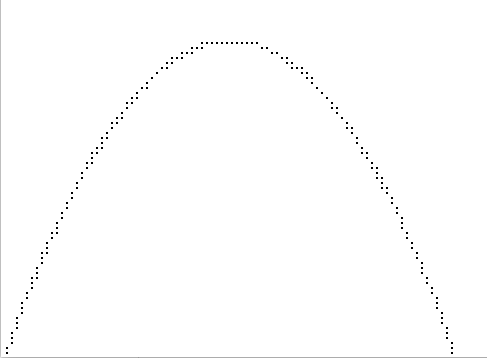

# variable_duty_cycle

Experiments with VDC (Variable Duty Cycle)

The Variable Duty Cycle algorithm is a beautifully simple but elegant
general purpose algorithm. It's uses range from the generation of
Analog signals, to graphics drawing routines, amongst many other uses.

I first discovered this algorithm in a BYTE magazine in the early 1980's
which is now usefully linked and archived in the internet archive here:

https://archive.org/stream/byte-magazine-1981-10/1981_10_BYTE_06-10_Local_Networks#page/n389/mode/2up


# General notes

These are all simulations, for illustration purposes.

The LOOP_TIME sets the run rate of the main loop, which can be anything, as long as it
does not change across the lifecycle of the test and is reasonably constant. Timing
is implemented using time horizons, so small variances in execution time of the main loop
will be self adjusted for (as opposed to using time.sleep() which would not self adjust
to variances in loop execution time).

NOTE 1: While these examples can use floating point numbers, note that if the duty_master and
duty_cycle are set to integer numbers of the correct ratio, the same output will be
generated as if the tests were performed with floating point values. This makes the
algorithms idea for implementation on tiny 8-bit processors without floating point
support.

NOTE 2: For unusual fractional ratios (e.g. 27/100), look very carefully at the
output bitstream - the average high-time is indeed 27/100 - compare it
against 25/100. The point to note here, is that the run length of the pattern
is not constant. As a beneficial side effect of this, any ratio will always
be generated in the minimum required bitstream length. But don't confuse
this with PWM with a fixed period - think of it as PWM with an optimal
period required to generate that duty cycle given the LOOP_TIME.


# General form

The algorithm takes on the following general form:

```
initialise duty_master, duty_counter
    where duty_master > 0
    and   duty_counter >= 0
    and   duty_counter <= duty_master

kickor_loop:
do forever
    wait for next time period
    duty_counter = duty_counter - duty_cycle
    if duty_counter is negative
        initiate_kickee_action
        duty_counter = duty_counter + duty_master
    end if
end do
```

There is a generic.py that shows a generic form in Python that can be used as a starting
point for a simulator for any system.


# ADC example

file: ADC.py

The ADC example shows how a PWM signal can be generated and sent to a digital output pin.
Don't confuse the duty_master with the period, it's not really that. It is the ratio
between the duty_cycle and duty_master that is most important.

As an illustration, use the following test values and observe the output stream carefully:

|M    |C      |ratio | bitstream
|---  |---    |---   |---
|4    |1      |25%   | 1000
|100  |25     |25%   | 1000
|4    |4      |100%  | 1111
|100  |27     |27%   | 10010001000


# Ratio matching example

file: ratio_match.py

This shows how two values can be gradually increased from zero upwards, while
maintaining a ratio between them. For example, if a max value was specified which
caused both values to be reset to zero when one reaches a known maximum, this would
generate two perfectly time synchronised ramps, with different amplitudes.


# Projectile plotting example

file: projectile.py



Shows the calculation of a projectile fired from a start point with a given
vertical and horizontal velocity.

Note there are two VDC instances in this algorithm, and it introduces the
concept of a negative duty cycle for the vertical velocity.

There were two bugs in the original code presentation, that have been fixed.


# Miles travelled to Kilometers travelled conversion

file:miles_to_kilometers.py

This simulates an input circuit that sends a pulse when some fixed distance has
been travelled. The internal ratio converter then counts these pulses and generates
output pulses at a ratio affected rate that represents some multiple of kilometers
travelled.

This one is particularly tricky because the ratio is such that you have to travel
a fraction of a mile to travel 1 kilometer. (kilometers to miles would be easier
to model!). This is solved by scaling all the maths up by a factor of 10 in the 
ratio, and scaling down the representable value at display, to enforce the requirement
that the duty_cycle <= duty_master.


# TODO's

* plot on the screen.py canvas the growth of the counter in each example,
so that it is possible for people to visualise how the algorithm works

* Turn the VDC algorithm into a reusable parameterised Python class and create OO versions of 
these examples that use that new class instance. A bit like the generic PID algorithm I wrote
in Ada, when at University.

* Investigate use of the VDC to synthesise musical tones. I'm particularly interested in this
as an alternative way of generating modulated tones on small micro:controllers, 
perhaps with some limited hardware assist via a simple hardware timing unit that effectively
implements the VDC algorithm with some simple counters.

* Link in some work on general prescaler registers, and show how this overlaps with the VDC
concept.

David Whale

@whaleygeek

April 2017


